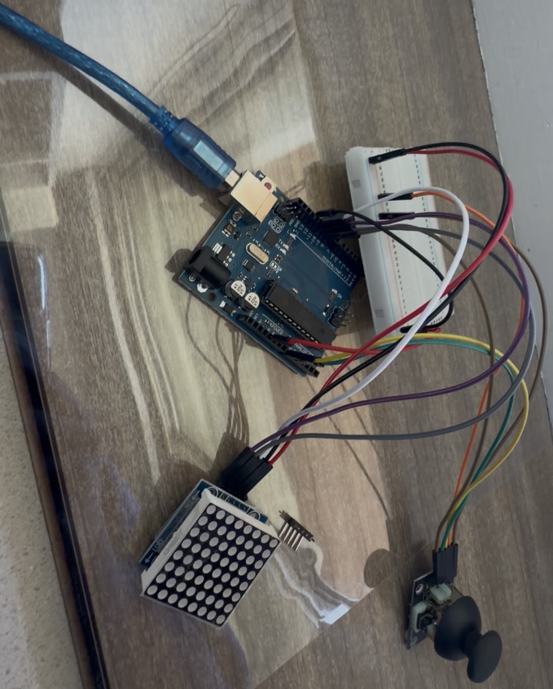

# Snake_Game
This project is a spin on the traditional snake game, by adding a 8x8 LED matrix board as the game screen.  This project runs using a Arduino Uno as a mirco controller and has a joystick to control the movement of the snake. In the future, I would like to add a high score counter and speaker for game play sound.

# Code
- [Complete Snake Game Code](Snake_Game.ino)

# Materials Required

| **Part** | **Note** | **Price** | **Link** |
|:--:|:--:|:--:|:--:|
| Elegoo Starter Kit | Includes Arduino Uno, reisitors, etc. | $44.99 | <a href="https://www.amazon.com/ELEGOO-Project-Tutorial-Controller-Projects/dp/B01D8KOZF4/ref=sr_1_3_pp?crid=2CDRMQVSYOD4H&dib=eyJ2IjoiMSJ9.AcWZy-Yg4mDTnhzEHozxzPZdVC5-KUL2tW-OQewDKpA7ZhEVnlvYJFELmn1cEN5uvrZVxp4St_nlIhbtJibvxUj7s5mZJHZ5gTUoGHyjSCEJnV1m-a2PWxrXyWYqZrufz70WGPo3NV3-f7iFEXccDbUvJu8BRvjxPCjgkJ_uJnDxpPk3Gjw_yw7XMWWb8ll4GsOLKWrxeEr1uOS5BeD0EU2Y1MvZXAOcITMnykL7K69Fr4P6SnWB2EpkaJ37raPdYGD096Z_rSPyEsRfxIx6Rv9N65w4nRID980vI94aLYQ.PuIIln1now7ULLLgzCb0zPl5SBpDXd-IT05ToFwhflM&dib_tag=se&keywords=arduino+starter+kit&qid=1720652047&s=industrial&sprefix=arduino+starter+ki%2Cindustrial%2C72&sr=1-3"> Link </a> |
| 9V Batteries | Provides power to the circuit | $8.88 | <a href="https://www.amazon.com/Amazon-Basics-Performance-All-Purpose-Batteries/dp/B00MH4QM1S/ref=sr_1_5_pp?crid=3TQ7ANPH958JM&dib=eyJ2IjoiMSJ9.bmcV2Upj_vpB6G9CFlPPxYAryat512da7ekZjc52HecXSTmtx7PbJ50EgQFPCMqlAxjOUq-tL4vQTpozlHvH89bMwx-HJoyGcdz6EY8HrMxahTiqOXkoP7ewkDcgHoMhmHamdlQfW6FBHO0Gm-DYZZnnMuvEU3qOpemA8PGEvRhEx4-lGaBZhrvls039G1-9SizAW-YRGXZ2fFrdVDlREyyOhAuxXZaE5QqUxWesRQgP9UfGOYaInRWTTPwhDbXFa-RPzGbU1C_u4wq-NMqKBtWEQqR9-cA8O3FYOx3icEY.dtKJmI2T-iCmMM_bYnbiHUWzhKpJDRxS-bBmZIwYFKM&dib_tag=se&keywords=9v+batteries&qid=1720651326&rdc=1&s=electronics&sprefix=9v+batteries%2Celectronics%2C105&sr=1-5"> Link </a> |
| 8x8 Dot Module | Acts as the display module for the game | $11.99 | <a href="https://www.amazon.com/ALAMSCN-MAX7219-Display-Raspberry-Microcontroller/dp/B08SQT9GGB/ref=sr_1_6?crid=EKB5YLZR2HRK&dib=eyJ2IjoiMSJ9.lHn6ZkDX4LEZ7Ag3-iCVXkFy7AXOPnp8v63jOLxAmizkaIMzHuZ6uT2s0JzIluA3ko66s56GuMW1AGlSd-h6K2-o5PgwfC1bLVk4-fEAsC_eIk5rG1eQntpYE8r7f3n88i4820SV7pl6TGShXrL9kW5-xE8HLZhcR1elb6u89Ss_SfVXTjGivtdHnL8Cei6I1G6HMk1e9Kgd1WVlb7I5ADovI-1whA1zWSyCTRbxJXs.K3RJmUVOK4B7LVNGKwbYcPPfv60-65vChh7tsdXvQ5g&dib_tag=se&keywords=max7219+8x8+dot+matrix+module&qid=1780953289&sprefix=8x8+dot+modu%2Caps%2C144&sr=8-6"> Link </a> |

# Sources
- [Original Project Instructions](https://github.com/Kneschtie/Arduino-Snake-Game)
- [Original Project Instructions](https://docs.sunfounder.com/projects/3in1-kit-v2/en/latest/index.html)
